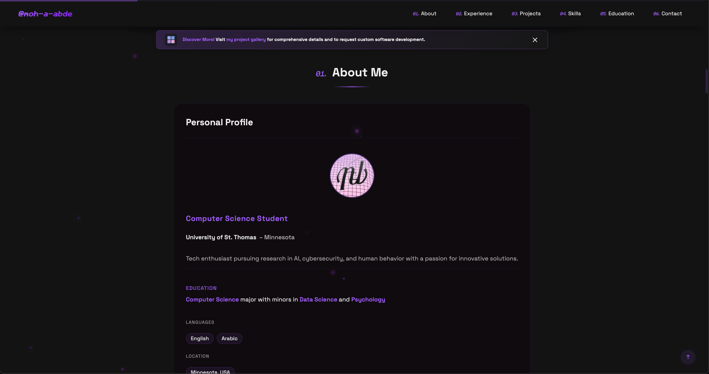

# Mohamed Abdel Hamid - Portfolio Website

This is the source code for my personal portfolio website, showcasing my skills, projects, and experience.

### Demo

## Landing Page

    

---

## About Me

    

---

## Tech Stack

    

---

## Preview

    

# Features

- Responsive design for all devices
- Interactive UI with animations
- Contact form with PHP backend
- Project showcase with modal details
- Skills and experience sections

# License

All rights reserved. © Mohamed A. Abdel Hamid.
