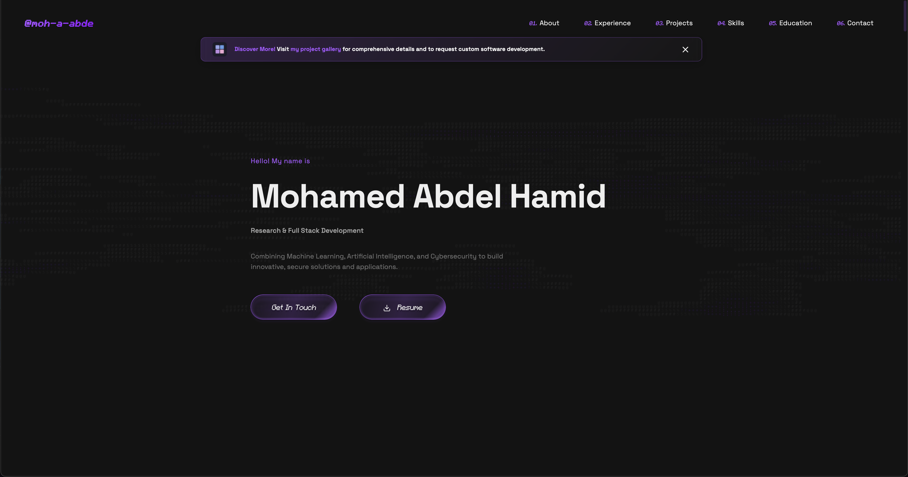
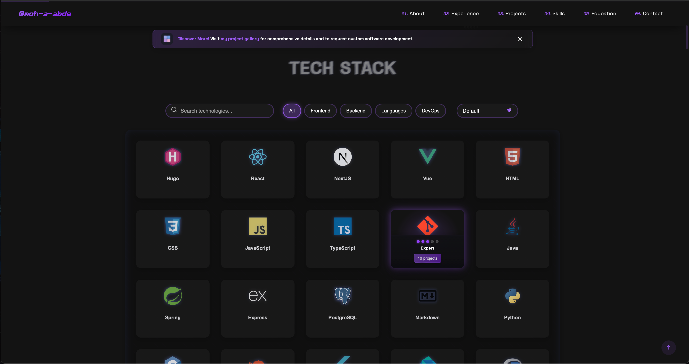
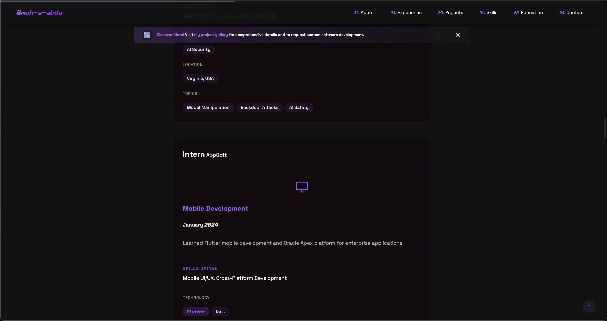

# Mohamed Abdel Hamid - Portfolio Website

This is the source code for my personal portfolio website, showcasing my skills, projects, and experience.

## Demo

## Demo

### Landing Page (Not Signed In)

    
    

---
### Landing Page (Not Signed In)

    
    

## Features

- Responsive design for all devices
- Interactive UI with animations
- Contact form with PHP backend
- Project showcase with modal details
- Skills and experience sections

## License

All rights reserved. © 2024 Mohamed A. Abdel Hamid.
